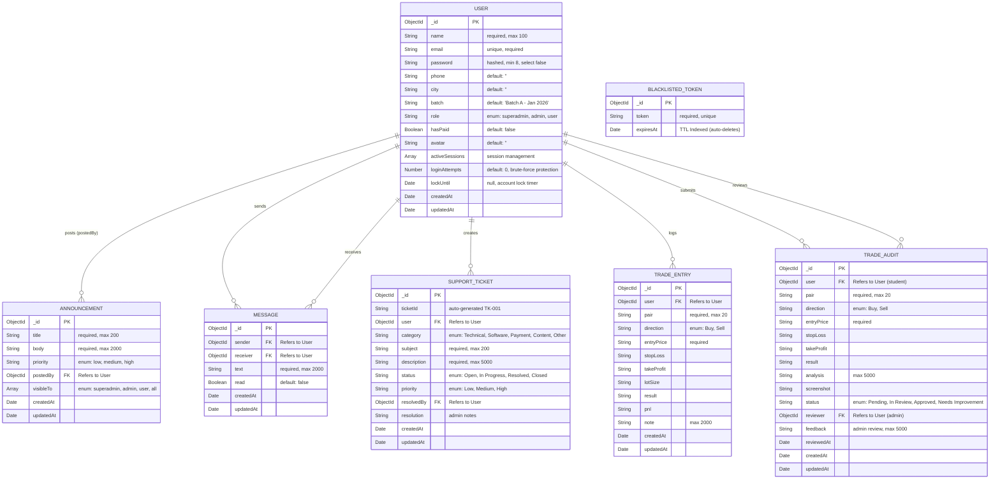

# Rajmudra MongoDB Database Schema Graph

This document serves as the lightweight "context graph" of the Rajmudra database. You can provide this single file to AI models in future coding sessions so they instantly understand your database structure without needing to scan every individual model file, saving time and context tokens!

## Entity Relationship Diagram (Mermaid Graph)

## Detailed File Models

### 1. `User.js`
- **Purpose**: Primary collection tracking user accounts, role-based access logic (`superadmin`, `admin`, `user`), and security checks.
- **Key Relationships**: Referenced by Announcement, Message, SupportTicket, TradeEntry, TradeAudit.
- **Core Methods**:
  - `pre('save')`: Hashes password if modified; generates 3-letter initials avatar if name is changed.
  - `comparePassword(candidate)`: Validates user login attempts.
  - `isLocked()`: Checks `lockUntil` field to see if account is temporarily locked due to brute-force protection.
- **Security**: Contains `activeSessions` array limiting multiple device logins, and `loginAttempts` counter. `password` has `select: false` so it doesn't accidentally leak on fetch.

### 2. `Announcement.js`
- **Purpose**: A bulletin board system model where Superadmins and Admins can share system-wide or role-specific notifications.
- **Key Relationships**: Uses `postedBy` to link to the User `ObjectId` who drafted the content.
- **Permissions**: Includes a `visibleTo` array limiting which user roles can query the message.
- **Sorting**: Contains a `priority` structure (`low`, `medium`, `high`).

### 3. `Message.js`
- **Purpose**: Direct messaging between users (students) and admins (instructors). Supports 1-to-1 conversation threads.
- **Key Relationships**: `sender` and `receiver` both reference User.
- **Indexes**: Compound index on `{ sender, receiver, createdAt }` for fast thread retrieval.
- **Read tracking**: `read` boolean allows unread count badges.

### 4. `SupportTicket.js`
- **Purpose**: Users can raise support tickets. Admins/superadmins can view, assign, and resolve them.
- **Auto-ID**: `pre('save')` hook generates sequential `TK-001`, `TK-002` ticket IDs.
- **Workflow**: Status flows: Open → In Progress → Resolved / Closed.
- **Resolution**: `resolvedBy` tracks which admin resolved the ticket with optional `resolution` notes.

### 5. `TradeEntry.js`
- **Purpose**: Personal trade journal for users to log and track their forex trades.
- **Scoped**: Each entry belongs to a single user. Only the user can view/delete their own entries.
- **Fields**: Captures full trade data: pair, direction, entry/SL/TP/lot, result, P&L, and analysis notes.

### 6. `TradeAudit.js`
- **Purpose**: Students submit trades for instructor review. Admins can approve or flag trades with feedback.
- **Workflow**: Status flows: Pending → In Review → Approved / Needs Improvement.
- **Review Fields**: `reviewer` (admin who reviewed), `feedback` (text), `reviewedAt` (timestamp).

### 7. `BlacklistedToken.js`
- **Purpose**: Invalidates JWT sessions securely. Since JWTs are stateless, actual "logout" requires throwing active tokens into a blacklist.
- **Performance**: Takes advantage of native MongoDB TTL (Time-To-Live). The database will automatically delete any document where the `expiresAt` date has passed, preventing database bloat.
- **Index**: Runs a unique and regular index on the exact `token` string for hyper-fast middleware verification.
